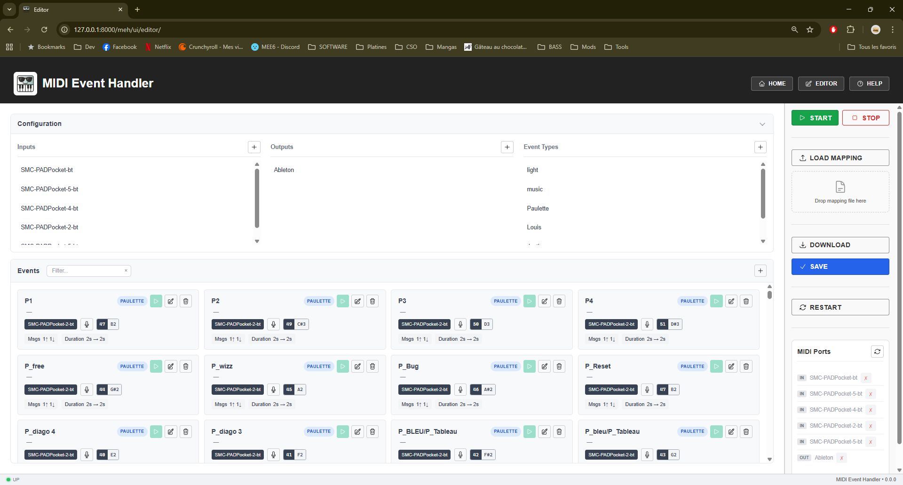
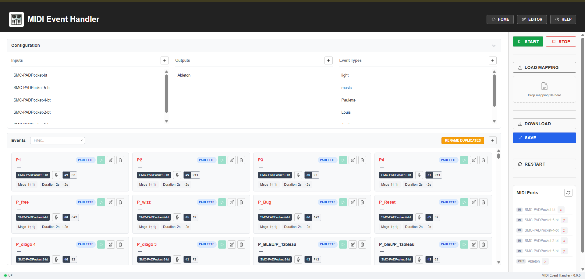
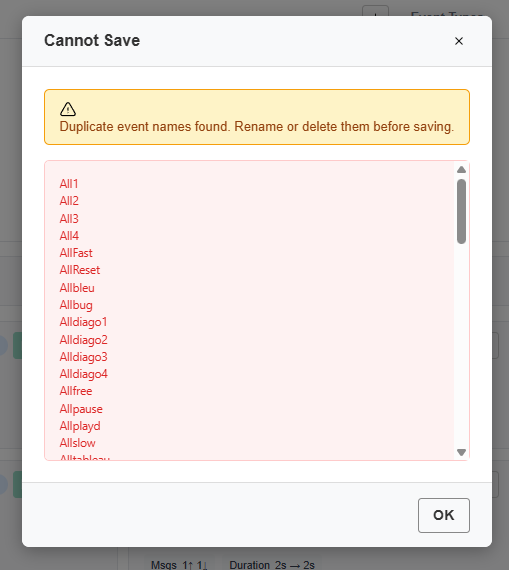
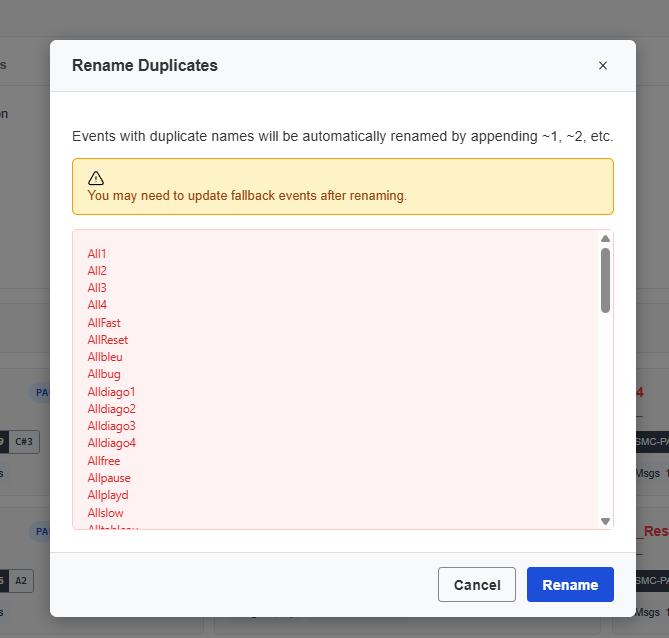

# MIDI Event Handler - User Manual

<p align="center">
  
</p>

## Table of Contents

1. [Introduction](#introduction)
2. [Installation](#installation)
3. [Quick Start](#quick-start)
4. [Dashboard](#dashboard)
5. [Editor](#editor)
6. [Configuration](#configuration)
7. [Troubleshooting](#troubleshooting)

---

## Introduction


MIDI Event Handler (MEH) is a powerful tool for mapping MIDI inputs to custom MIDI outputs with time-based behaviors. Perfect for live performances, theater productions, and automated MIDI routing.

**Key Features:**
- Map single notes or chords to MIDI outputs
- Time-based behaviors (min/max duration, fallback events)
- Real-time dashboard for show monitoring
- Visual editor for mapping configuration
- MIDI recording directly from your controller

---

## Installation

### Requirements
- Windows 10/11 (primary support)
- MIDI devices or virtual MIDI ports (e.g., loopMIDI)

### Using the Installer

1. Download the latest `midi-event-handler-setup_X.X.X.exe` from GitHub Releases
2. Run the installer and follow the prompts
3. Launch from Start Menu or Desktop shortcut

### Running from Source

```bash
poetry install
poetry run start-app
```

---

## Quick Start


1. **Launch the application** - The web interface opens automatically
2. **Configure your MIDI ports** - Go to the Editor page
3. **Create events** - Map triggers to outputs
4. **Start the runtime** - Click START in the sidebar

---

## Dashboard

The Dashboard provides real-time monitoring during shows.

### Overview


The dashboard header shows:
- **App Status**: RUNNING or STOPPED with LED indicator
- **Show Timer**: Elapsed time since start

The main area displays:
- **Active Events**: Event cards per type with countdown progress bars
- **Event Log**: Real-time START/END history with timestamps
- **MIDI Input**: Live display of incoming chords

### Statistics


- **Trigger Counts**: Most triggered events
- **Port Health**: Input port activity with color coding
  - 🟢 Green: Active (< 1 min)
  - 🟠 Orange: Warning (< 5 min)
  - 🔴 Red: Inactive (> 5 min)

---

## Editor

The Editor page allows full configuration of your MIDI mapping.

### Overview



The Editor page is divided into:
- A **Configuration** card (collapsible) with inputs, outputs and event types
- The **Events** list with filter, event cards and quick actions
- The **Sidebar** with controls, mapping loader and MIDI port status

### Configuration Panel

- **Inputs**: MIDI input ports to monitor
- **Outputs**: MIDI output ports for sending
- **Event Types**: Categories for organizing events

### Adding Inputs/Outputs


Click the **+** button to add a new input or output port.

### Events List


Each event card shows:
- Event name and type badge
- Comment (if any)
- Trigger port and notes
- Quick actions: Record, Edit, Delete

Use the filter to quickly find events by name.

### Creating/Editing Events


| Field | Description |
|-------|-------------|
| **Name** | Unique identifier |
| **Type** | Event category |
| **Comment** | Optional description |
| **Trigger Port** | Which input to monitor |
| **Trigger Notes** | MIDI notes as chord |
| **Start Messages** | Sent when event starts |
| **End Messages** | Sent when event ends |
| **Duration Min/Max** | Timing constraints |
| **Fallback Event** | Auto-trigger after max duration |

### Editing Trigger Notes


Click the 🎤 microphone icon to record notes from your MIDI controller, or click individual note badges to edit them.

### Editing Messages


Add start/end messages with port, note, and velocity settings.

### Testing Events (PAD Mode)


When the app is running:
- Click ▶ **PLAY** to manually trigger an event
- Click ■ **STOP** to end an active event
- Edit/Delete buttons are disabled while running

### Duplicate Event Names

Each event must have a unique name. If a mapping file is loaded with duplicate event names (e.g. from a hand-edited YAML file):



- Duplicate names are **highlighted in red** in the events list
- A **RENAME DUPLICATES** button appears in the events card header
- **Saving** and **starting** are blocked until duplicates are resolved



To fix duplicates:
1. Click **RENAME DUPLICATES** to open the confirmation modal
2. Review the list of affected names, then click **Rename** to auto-rename them (appends ~1, ~2, etc.)
3. Or manually rename/delete the duplicates using the edit button
4. Save your mapping once all names are unique



> **Note:** After renaming, check your fallback events — they may reference old names that no longer exist.

### Saving Changes


- Dirty indicator (🟡 yellow dot) shows unsaved changes
- Click **SAVE** to see a diff preview
- Confirm to save changes

### Deleting Items


Confirmation is required before deleting any item.

---

## Configuration

### config.yaml

```yaml
app:
  host: 127.0.0.1
  port: 8000

updates:
  check_on_start: true
  github_repo: "owner/repo"

logging:
  level: INFO
```

### mapping.yaml

See [README.md](../README.md) for full mapping file documentation.

---

## Troubleshooting

### Viewing Logs


The **Help** page provides access to application logs for debugging:

1. Click **HELP** in the navigation bar
2. Click **View Logs** to open the log viewer
3. Logs show MIDI activity, errors, and system events


### Error Notifications


When errors occur, a notification appears. Click **Details** to see more information:


### Ports Not Found

- Check that MIDI devices are connected
- Verify port names match (partial matching supported)
- Restart the application after connecting devices

### Duplicate Event Names

If event names appear in red and you cannot save or start:


- Your mapping contains events with the same name
- Click **RENAME DUPLICATES** in the events card header to auto-fix
- Or manually rename/delete the duplicates
- This can happen when editing the YAML mapping file by hand

### Events Not Triggering

- Verify the app is RUNNING (green indicator)
- Check trigger notes match exactly
- Confirm input port is available
- Check logs for error messages

### WebSocket Disconnected

- Check browser console for errors
- Refresh the page
- The connection auto-reconnects

---

## Keyboard Shortcuts

| Key | Action |
|-----|--------|
| `ESC` | Cancel recording / Close modal |

---

<p align="center">
  <i>For more information, visit the <a href="https://github.com/Lanceliogs/midi-event-handler">GitHub repository</a>.</i>
</p>
