# MIDI Event Handler - Manuel Utilisateur

<p align="center">
  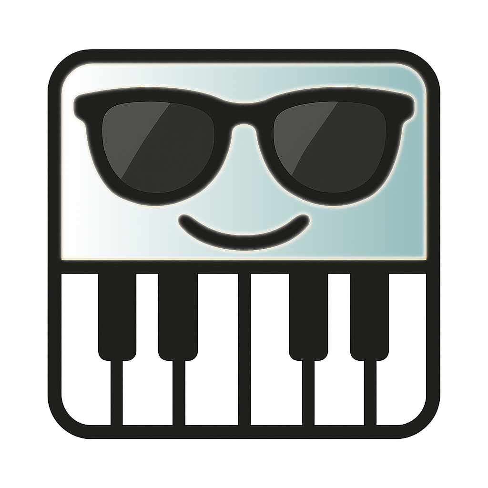
</p>

## Table des Matières

1. [Introduction](#introduction)
2. [Installation](#installation)
3. [Démarrage Rapide](#démarrage-rapide)
4. [Tableau de Bord](#tableau-de-bord)
5. [Éditeur](#éditeur)
6. [Configuration](#configuration)
7. [Dépannage](#dépannage)

---

## Introduction

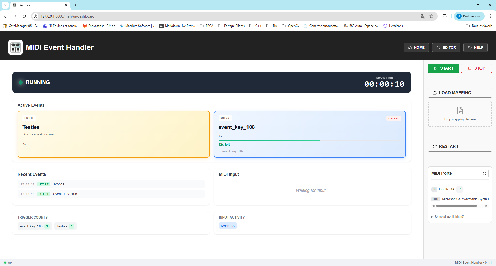

MIDI Event Handler (MEH) est un outil puissant pour mapper des entrées MIDI vers des sorties MIDI personnalisées avec des comportements temporels. Parfait pour les performances live, les productions théâtrales et le routage MIDI automatisé.

**Fonctionnalités Clés :**
- Mapper des notes simples ou des accords vers des sorties MIDI
- Comportements temporels (durée min/max, événements de repli)
- Tableau de bord temps réel pour le suivi des spectacles
- Éditeur visuel pour la configuration du mapping
- Enregistrement MIDI directement depuis votre contrôleur

---

## Installation

### Prérequis
- Windows 10/11 (support principal)
- Périphériques MIDI ou ports MIDI virtuels (ex: loopMIDI)

### Utilisation de l'Installateur

1. Téléchargez le dernier `midi-event-handler-setup_X.X.X.exe` depuis GitHub Releases
2. Exécutez l'installateur et suivez les instructions
3. Lancez depuis le Menu Démarrer ou le raccourci Bureau

### Exécution depuis les Sources

```bash
poetry install
poetry run start-app
```

---

## Démarrage Rapide

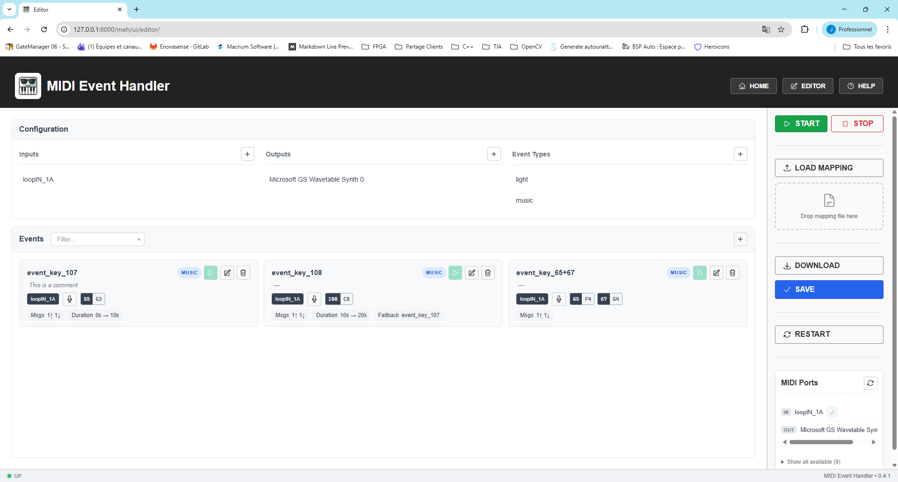

1. **Lancez l'application** - L'interface web s'ouvre automatiquement
2. **Configurez vos ports MIDI** - Allez dans la page Éditeur
3. **Créez des événements** - Mappez les déclencheurs aux sorties
4. **Démarrez le runtime** - Cliquez sur DÉMARRER dans la barre latérale

---

## Tableau de Bord

Le Tableau de Bord offre une surveillance en temps réel pendant les spectacles.

### Vue d'ensemble


L'en-tête du tableau de bord affiche :
- **Statut de l'App** : EN COURS ou ARRÊTÉ avec indicateur LED
- **Chronomètre du Show** : Temps écoulé depuis le démarrage

La zone principale affiche :
- **Événements Actifs** : Cartes par type avec barres de progression
- **Journal** : Historique DÉBUT/FIN en temps réel avec horodatage
- **Entrées MIDI** : Affichage en direct des accords entrants

### Statistiques

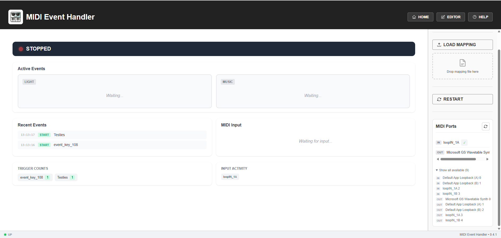

- **Compteurs de Déclenchement** : Événements les plus déclenchés
- **Santé des Ports** : Activité des ports d'entrée avec code couleur
  - 🟢 Vert : Actif (< 1 min)
  - 🟠 Orange : Attention (< 5 min)
  - 🔴 Rouge : Inactif (> 5 min)

---

## Éditeur

La page Éditeur permet la configuration complète de votre mapping MIDI.

### Panneau de Configuration


- **Entrées** : Ports d'entrée MIDI à surveiller
- **Sorties** : Ports de sortie MIDI pour l'envoi
- **Types d'Événements** : Catégories pour organiser les événements

### Ajout d'Entrées/Sorties

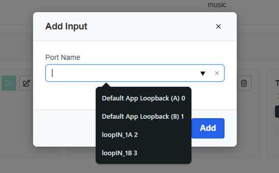

Cliquez sur le bouton **+** pour ajouter un nouveau port d'entrée ou de sortie.

### Liste des Événements

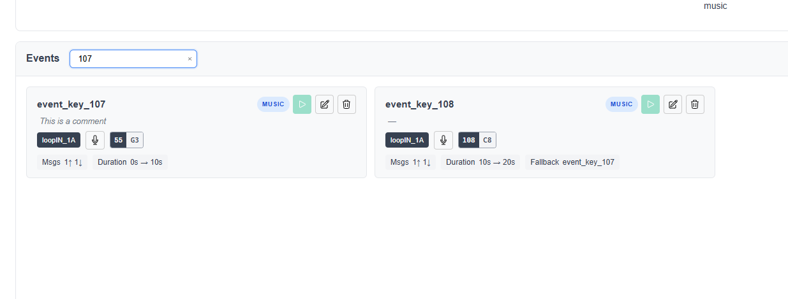

Chaque carte d'événement affiche :
- Nom de l'événement et badge de type
- Commentaire (si présent)
- Port de déclenchement et notes
- Actions rapides : Enregistrer, Éditer, Supprimer

Utilisez le filtre pour trouver rapidement des événements par nom.

### Création/Édition d'Événements

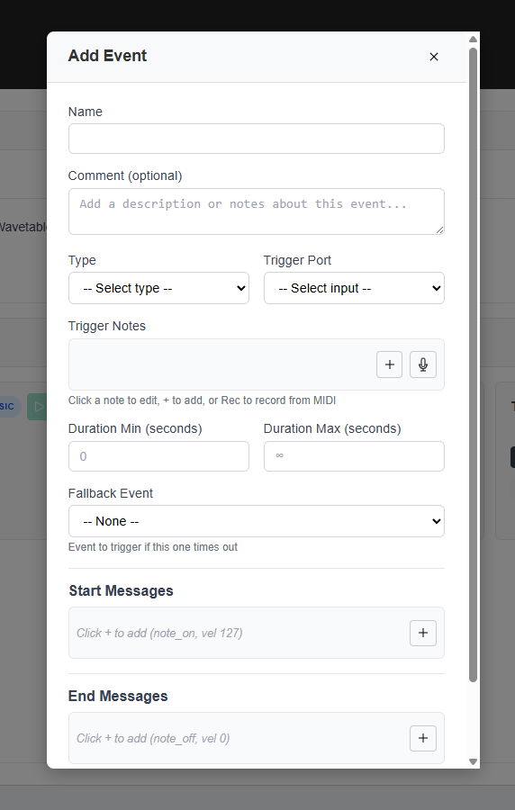

| Champ | Description |
|-------|-------------|
| **Nom** | Identifiant unique |
| **Type** | Catégorie de l'événement |
| **Commentaire** | Description optionnelle |
| **Port de Déclenchement** | Quelle entrée surveiller |
| **Notes de Déclenchement** | Notes MIDI en accord |
| **Messages de Début** | Envoyés au démarrage |
| **Messages de Fin** | Envoyés à la fin |
| **Durée Min/Max** | Contraintes temporelles |
| **Événement de Repli** | Déclenché après durée max |

### Édition des Notes de Déclenchement

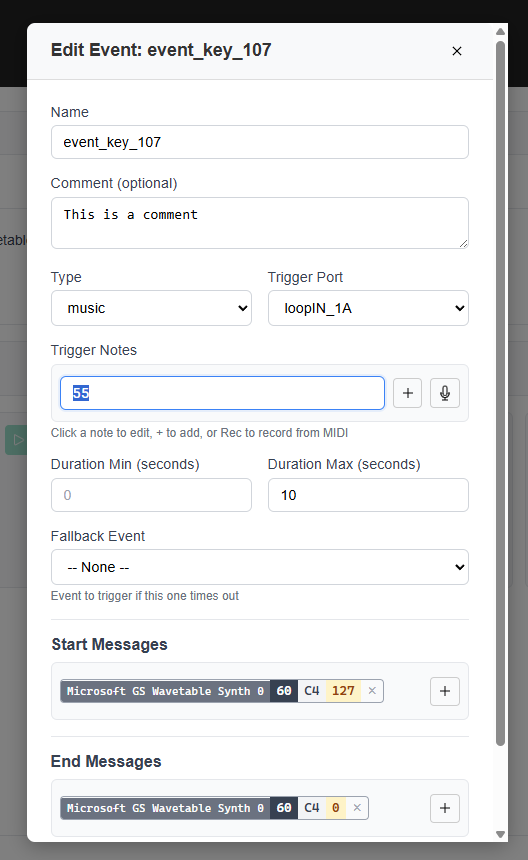

Cliquez sur l'icône 🎤 microphone pour enregistrer les notes depuis votre contrôleur MIDI, ou cliquez sur les badges de notes pour les modifier individuellement.

### Édition des Messages

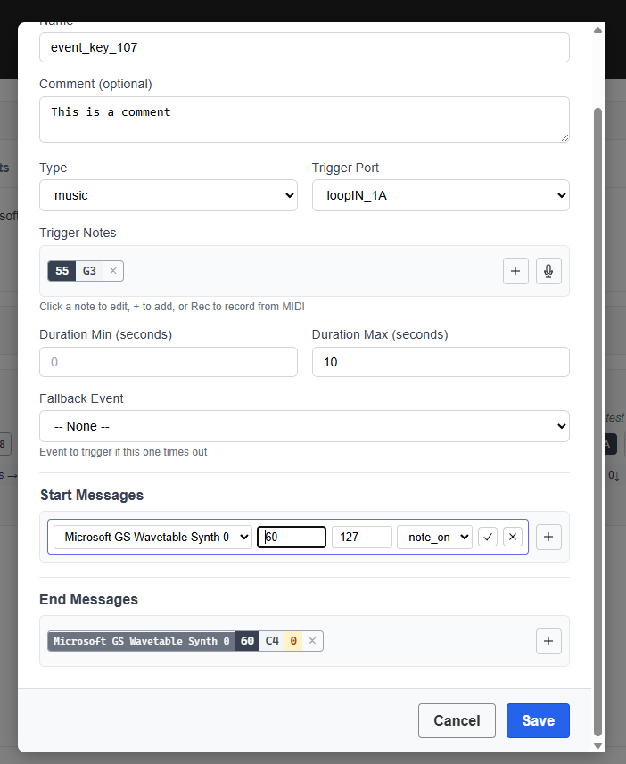

Ajoutez des messages de début/fin avec les paramètres de port, note et vélocité.

### Test des Événements (Mode PAD)

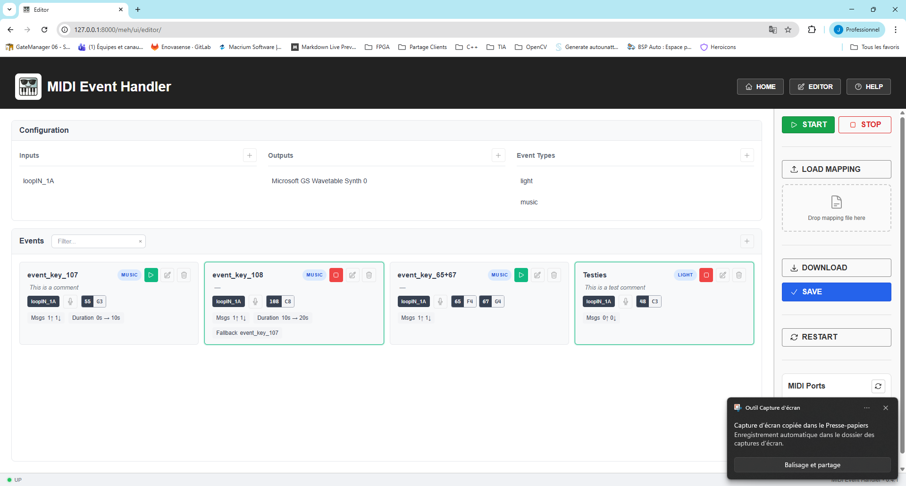

Quand l'application est en cours :
- Cliquez sur ▶ **PLAY** pour déclencher manuellement un événement
- Cliquez sur ■ **STOP** pour arrêter un événement actif
- Les boutons Éditer/Supprimer sont désactivés pendant l'exécution

### Sauvegarde des Modifications

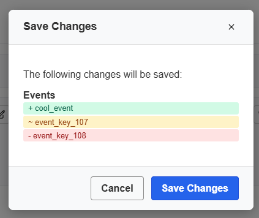

- L'indicateur de modification (🟡 point jaune) montre les changements non sauvegardés
- Cliquez sur **SAUVEGARDER** pour voir un aperçu des différences
- Confirmez pour sauvegarder

### Suppression d'Éléments

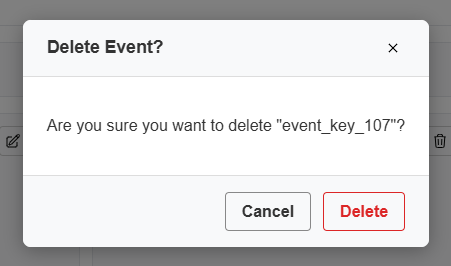

Une confirmation est requise avant de supprimer un élément.

---

## Configuration

### config.yaml

```yaml
app:
  host: 127.0.0.1
  port: 8000

updates:
  check_on_start: true
  github_repo: "owner/repo"

logging:
  level: INFO
```

### mapping.yaml

Voir [README.md](../README.md) pour la documentation complète du fichier de mapping.

---

## Dépannage

### Consulter les Logs

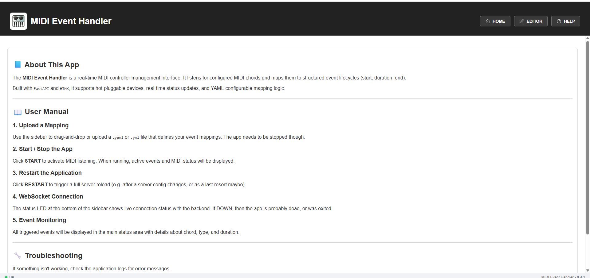

La page **Aide** permet d'accéder aux logs de l'application pour le débogage :

1. Cliquez sur **AIDE** dans la barre de navigation
2. Cliquez sur **Voir les Logs** pour ouvrir la visionneuse
3. Les logs affichent l'activité MIDI, les erreurs et les événements système

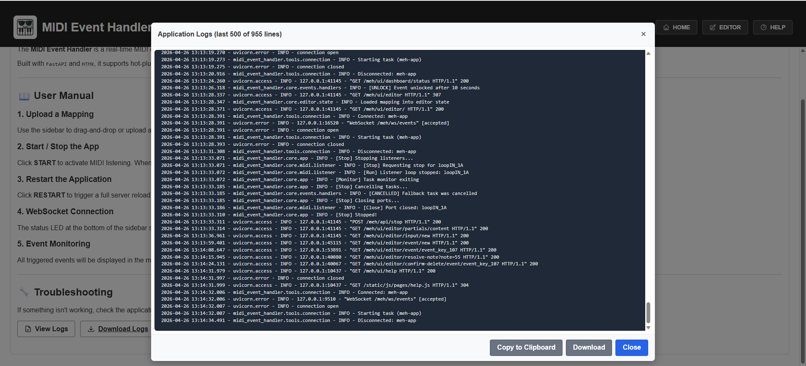

### Notifications d'Erreur

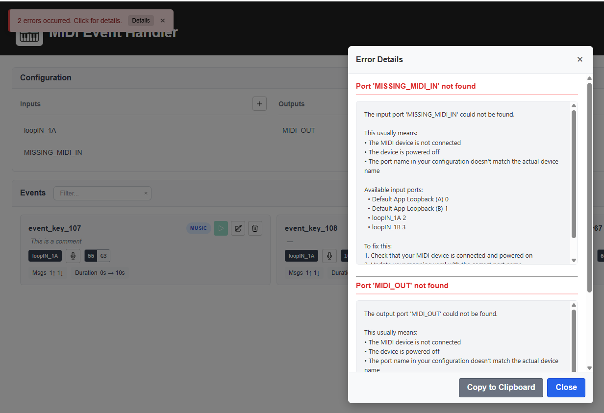

Quand des erreurs surviennent, une notification apparaît. Cliquez sur **Détails** pour plus d'informations :

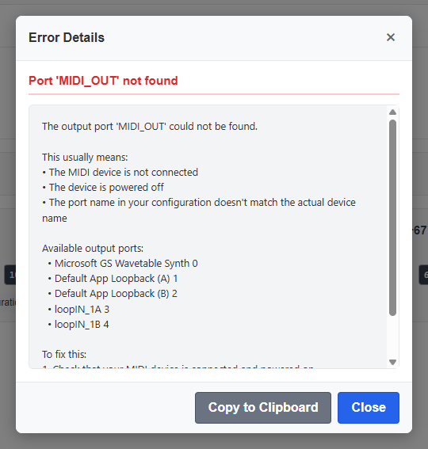

### Ports Non Trouvés

- Vérifiez que les périphériques MIDI sont connectés
- Vérifiez que les noms de ports correspondent (correspondance partielle supportée)
- Redémarrez l'application après avoir connecté les périphériques

### Événements Non Déclenchés

- Vérifiez que l'app est EN COURS (indicateur vert)
- Vérifiez que les notes de déclenchement correspondent exactement
- Confirmez que le port d'entrée est disponible
- Consultez les logs pour les messages d'erreur

### WebSocket Déconnecté

- Vérifiez la console du navigateur pour les erreurs
- Rafraîchissez la page
- La connexion se reconnecte automatiquement

---

## Raccourcis Clavier

| Touche | Action |
|--------|--------|
| `ÉCHAP` | Annuler l'enregistrement / Fermer le modal |

---

<p align="center">
  <i>Pour plus d'informations, visitez le <a href="https://github.com/your-repo">dépôt GitHub</a>.</i>
</p>
